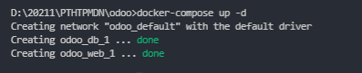
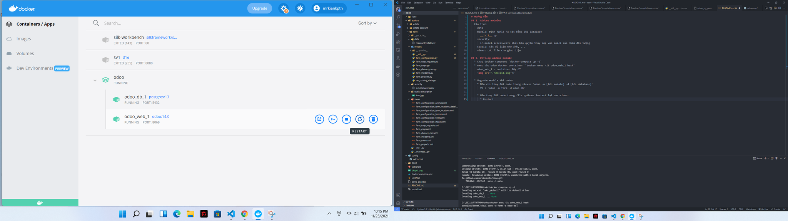

# Hướng dẫn 
## 1. Addons modules
  Cấu trúc: 
    data
    models: Định nghĩa ra các bảng cho database
      __init__.py
    security:
      ir.model.access.csv: khai báo quyền truy cập vào model của nhóm đối tượng
    static: các dữ liệu như ảnh, ...
    views: các file cho giao diện

## 2. Develop addons module
  * Chạy docker compose: `docker-compose up -d`
  * exec vào odoo docker container: `docker exec -it odoo_web_1 bash`
    odoo_web_1 : container lấy ở" 
    

  * Upgrade module khi code:
    * Nếu chỉ thay đổi code trong views: `odoo -u [tên module] -d [tên database]`
      VD : `odoo -u farm -d odoo-db`

    * Nếu thay đổi code trong file python: Restart lại container:
      * Restart trong docker desktop
      
      * Hoặc: `docker-compose down` rồi `docker-compose up -d`, rồi exec và update như trên